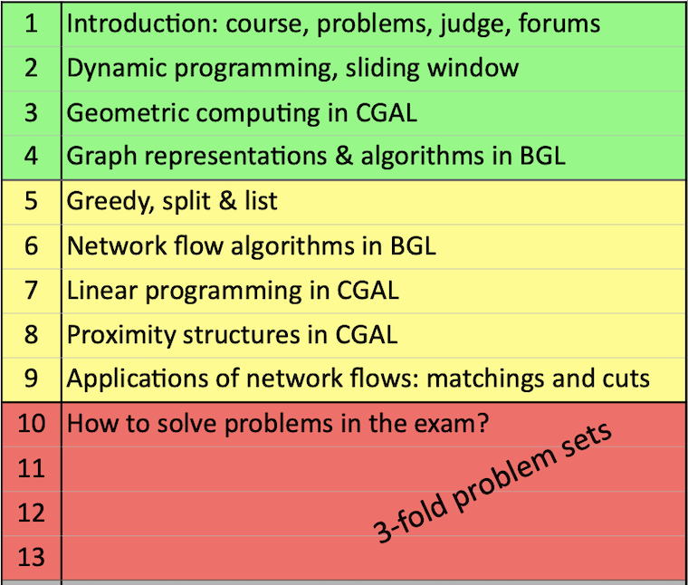

# Algolab 2024

## Introduction to Algorithms Lab

### What is this course about?
The objective of the course is to learn how to solve algorithmic problems given by a textual, story-like description (IOI style). The topics covered are many, including dynamic programming, greedy, basic graph algorithms (MST, SP, MM, ...), flow graph algorithms, more advanced flow graph algorithms (MinCostMaxFlow, MinCut, ...), geometry, triangulations, linear programming, and more.

### How is it erogated?
Every week there are 4 problems to be solved relevant to the topic introduced, plus a problem of the week (POW) that serves as a simulation to the exam. After week9 there are four weeks where problems become more challenging since they include the difficulty of finding out the most efficient algorithm to solve them ("Can greedy work? Is it DP, LP, or MaxFlow?" Sometimes it's really hard to tell!)



### What's my perspective?
This course was very fun and interesting, it greatly boosted my problem-solving skills and my coding-interview skills have improved drastically. However, if you dont have experience in competitive programming (like me :( ), be ready to work very hard. My starting skills were very weak, so I felt like I had to put 3x effort than an 8ects course. However, this differs from person to person, and you might not feel the need to put this much time as I did.

### What will you find in this repo?
This repo is organised as follows:
* [Solutions per Week](#solutions-per-week)
* [Solutions per Topic](#solutions-per-topic)
* [General advices](#general-advices)
* [My notes](#my-notes)
* [Credits](#credits)

For each solution I have provided the code (under solution.cpp) and an explanation (under explanation.md) of my code and reasoning. Most of my explanations are verbose and you might not find them accurate or helpful, but they really helped me to understand better the problems, and hopefully they can help you too. I felt like in the other repos the explanations were more concise missing some details that I was not always understandings, if this case is the same for you, I think these kind of explanations can really help you to solve those doubts (but take care that they might be inaccurate). **Every solution guarantees 100/100 pts.**

Note: We are not allowed to share the texts of the problems, but I often provide a summarised story, in particular for the problems of the last 4 weeks.

## Solutions per Week

| Week | POW | Problem 1 | Problem 2 | Problem 3 | Problem 4 |
|------|-----|-----------|-----------|-----------|-----------|
| Week 1 | None | [Dominoes](/src/week01/dominoes) | [Even pairs](/src/week01/even_pairs) | [Even matrices](/src/week01/even_matrices) | [Build the Sum](/src/week01/build_the_sum) |
| Week 2 | [POW 2: Deck of cards](/src/week02/deck_of_cards) | [Beach bars](/src/week02/beach_bars) | [Burning coins](/src/week02/burning_coins) | [Defensive line](/src/week02/defensive_line) | [The great game](/src/week02/the_great_game) |
| Week 3 | [POW 3: James Bond’s sovereign](/src/week03/james_bonds_sovereign) | [First steps with BGL](/src/week03/first_steps_with_bgl) | [Buddy Selection](/src/week03/buddy_selection) | [Ant Challenge](/src/week03/ant_challenge) | [Important Bridges](/src/week03/important_bridges) |
| Week 4 | [POW 4: The Iron Islands](/src/week04/iron_islands) | [Hit](/src/week04/hit) | [First Hit](/src/week04/first_hit) | [Antenna](/src/week04/antenna) | [Hiking Maps](/src/week04/hiking_maps) |
| Week 5 | [POW 5: Tracking](/src/week05/tracking) | [Moving Books](/src/week05/moving_books) | [Asterix the Gaul](/src/week05/asterix_the_gaul) | [Severus Snape](/src/week05/severus_snape) | [Boats](/src/week05/boats) |
| Week 6 | [POW 6: Motorcycles](/src/week06/motorcycles) | [Tiles](/src/week06/tiles) | [Coin Tossing Tournament](/src/week06/coin_tossing) | [Knights](/src/week06/knights) | [Kingdom Defense](/src/week06/kingdom_defense) |
| Week 7 | [POW 7: Octopussy](/src/week07/octopussy) | [Bistro](/src/week07/bistro) | [H1N1](/src/week07/H1N1) | [Germs](/src/week07/germs) | [Clues](/src/week07/clues) |
| Week 8 | [POW 8: Attack on King's Landing](/src/week08/attack_on_kings_landing) | [Maximize it!](/src/week08/maximize_it) | [Diet](/src/week08/diet) | [Inball](/src/week08/inball) | [Casterly Rock](/src/week08/casterly_rock) |
| Week 9 | [POW 9: Idefix](/src/week09/idefix) | [Placing Knights](/src/week09/placing_knights) | [Real Estate Market](/src/week09/real_estate_market) | [Canteen](/src/week09/canteen) | [Algocoon](/src/week09/algocoon) |
| Week 10 | [POW 10: Hermione Granger](/src/week10/hermione_granger) | [Asterix and the Tour of Gaul](/src/week10/asterix_and_the_tour_of_gaul) | [Rubeus Hagrid](/src/week10/rubeus_hagrid) | [San Francisco](/src/week10/san_francisco) | [The Hand’s Tourney](/src/week10/the_hands_tourney) |
| Week 11 | [POW 11: Ceryneian Hind](/src/week11/ceryneian_hind) | [Asterix in Switzerland](/src/week11/asterix_in_switzerland) | [Lernaean Hydra](/src/week11/lernaean_hydra) | [Sith](/src/week11/sith) | [Wordcup](/src/week11/wordcup) |
| Week 12 | [POW 12: Pied Piper](/src/week12/pied_piper) | [Alastor Moody](/src/week12/alastor_moody) | [Nemean Lion](/src/week12/nemean_lion) | [Rapunzel](/src/week12/rapunzel) | [Return of the Jedi](/src/week12/return_of_the_jedi) |
| Week 13 | [POW 13: Schneewittchen](/src/week13/schneewittchen) | [Asterix and the Chariot Race](/src/week13/asterix_and_the_chariot_race) | [Car Sharing](/src/week13/car_sharing) | [Fighting Pits of Meereen](/src/week13/fighting_pits_of_meereen) | [Suez](/src/week13/suez) |
| Week 14 | [POW 14: Ludo Bagman](/src/week14/ludo_bagman)


## Solutions per Topic

| Topic | Problems |
|-------|----------|
| INTRO | [Build the Sum](/src/week01/build_the_sum) |
| PREFIX | [Even pairs](/src/week01/even_pairs), [Even matrices](/src/week01/even_matrices) |
| DP | [Burning coins](/src/week02/burning_coins), [Defensive line](/src/week02/defensive_line), [The great game](/src/week02/the_great_game), [San Francisco](/src/week10/san_francisco), [Lernaean Hydra](/src/week11/lernaean_hydra), [POW 12: Pied Piper](/src/week12/pied_piper), [Asterix and the Chariot Race](/src/week13/asterix_and_the_chariot_race), [Fighting Pits of Meereen](/src/week13/fighting_pits_of_meereen) |
| SW | [POW 2: Deck of cards](/src/week02/deck_of_cards), [Beach bars](/src/week02/beach_bars) |
| SP | [First steps with BGL](/src/week03/first_steps_with_bgl), [Ant Challenge](/src/week03/ant_challenge), [POW 5: Tracking](/src/week05/tracking), [POW 8: Attack on King's Landing](/src/week08/attack_on_kings_landing), [Alastor Moody](/src/week12/alastor_moody), [Return of the Jedi](/src/week12/return_of_the_jedi) |
| MST | [First steps with BGL](/src/week03/first_steps_with_bgl), [Ant Challenge](/src/week03/ant_challenge), [Return of the Jedi](/src/week12/return_of_the_jedi) |
| MM | [Buddy Selection](/src/week03/buddy_selection), [Tiles](/src/week06/tiles), [POW 8: Attack on King's Landing](/src/week08/attack_on_kings_landing) |
| SCC | [Important Bridges](/src/week03/important_bridges) |
| GC | [Hit](/src/week04/hit), [First Hit](/src/week04/first_hit), [Antenna](/src/week04/antenna), [Hiking Maps](/src/week04/hiking_maps), [POW 6: Motorcycles](/src/week06/motorcycles) |
| GREEDY | [Moving Books](/src/week05/moving_books), [Boats](/src/week05/boats), [POW 7: Octopussy](/src/week07/octopussy), [Rubeus Hagrid](/src/week10/rubeus_hagrid) |
| S. & L. | [Asterix the Gaul](/src/week05/asterix_the_gaul) |
| GREEDP | [Severus Snape](/src/week05/severus_snape) |
| MF | [Coin Tossing Tournament](/src/week06/coin_tossing), [Knights](/src/week06/knights), [Kingdom Defense](/src/week06/kingdom_defense), [Placing Knights](/src/week09/placing_knights), [Algocoon](/src/week09/algocoon), [POW 11: Ceryneian Hind](/src/week11/ceryneian_hind), [Asterix in Switzerland](/src/week11/asterix_in_switzerland), [Alastor Moody](/src/week12/alastor_moody) |
| MCMF | [Real Estate Market](/src/week09/real_estate_market), [Canteen](/src/week09/canteen), [Asterix and the Tour of Gaul](/src/week10/asterix_and_the_tour_of_gaul), [Car Sharing](/src/week13/car_sharing), [POW 14: Ludo Bagman](/src/week14/ludo_bagman) |
| LP | [Maximize it!](/src/week08/maximize_it), [Diet](/src/week08/diet), [Inball](/src/week08/inball), [Casterly Rock](/src/week08/casterly_rock), [POW 10: Hermione Granger](/src/week10/hermione_granger), [Wordcup](/src/week11/wordcup), [POW 13: Schneewittchen](/src/week13/schneewittchen), [Suez](/src/week13/suez) |
| UF | [POW 9: Idefix](/src/week09/idefix), [The Hand’s Tourney](/src/week10/the_hands_tourney), [Sith](/src/week11/sith) |
| TRI | [Bistro](/src/week07/bistro), [H1N1](/src/week07/H1N1), [Germs](/src/week07/germs), [Clues](/src/week07/clues), [POW 10: Hermione Granger](/src/week10/hermione_granger), [Nemean Lion](/src/week12/nemean_lion) |
| SW+ | [POW 4: The Iron Islands](/src/week04/iron_islands), [Rapunzel](/src/week12/rapunzel) |
| MC | [Algocoon](/src/week09/algocoon), [POW 11: Ceryneian Hind](/src/week11/ceryneian_hind) |


| Abbreviation | Meaning |
|-------------|---------|
| DP | Dynamic Programming |
| SW | Sliding Window |
| SP | Shortest Paths |
| MST | Minimum Spanning Tree |
| MM | Maximum Matching |
| SCC | Strongly Connected Components |
| GC | Geometry (Computational Geometry) |
| GREEDY | Greedy Algorithms |
| S. & L. | Split and List |
| GREEDP | Greedy + Dynamic Programming |
| MF | Maximum Flow |
| MCMF | Minimum Cost Maximum Flow |
| LP | Linear Programming |
| UF | Union-Find (Disjoint Set) |
| TRI | Triangulation |
| SW+ | Sliding Window + Additional Techniques |
| MC | Min-Cut |

## General advices
* To avoid rewriting the same redundant codes I would recommend the following structure
```cpp
#include <bits/stdc++.h>

/*
Here you put all the needed additional typedefs and GCAL/BGL libraries you need
*/

void solve() {
    // The function containing the main logic of your solution
}

int main() {
  std::ios_base::sync_with_stdio(false);
  std::cin.tie(nullptr);
  int t; std::cin >> t;
  while(t--) solve();
}
```
* Every week there is a POW (Problem of the Week) where you practice a new exercise in exam conditions (2h time, hidden tests, etc.). Make sure you train your time-management skills and attempt the POW at least a few times!

* BGL and CGAL interfaces might look confusing at first. Luckily you are provided with code snippets that contain 95% of the functions you need, make sure you understand them and know how to use them!

* A minority of the functions is not given in the code snippets, make sure you know how to navigate the documentations that you will be provided at the exam.

* Each day of the exam you will have one problem that is "algorithmically the same to one of the problems you worked during the semester"  (any problem, including POW), which means different story but same exact solution. Make sure you get these points at the exam, even though 200pts do not guarantee passing (which is typically around 250/600pts).

* Focus on partial points. Sometimes solving all the test sets is very challenging, but the first 50/60 pts have assumptions that greatly simplify the problem.

* Personally, I could not find the time to work on additional problems, I finished all the problems just two days before the exams. But definitely if you are faster than me in finishing all the problems, check out other repositories containing new exercises to practice on.

## My Notes

- [Introduction](/nts/intro.md)
- [Dynamic Programming](/nts/dp.md)
- [Greedy Algorithms](/nts/greedy.md)
- [Split and List](/nts/s_and_l.md)
- [Computational Geometry](/nts/cg.md)
- [Proximity Structures](/nts/prox.md)
- [Linear Programming](/nts/lp.md)
- [Graph Theory](/nts/graphs.md)
- [Network Flow](/nts/flow.md)
- [Advanced Flow](/nts/adv_flow.md)

## Credits
Algolab is a really challenging course, and not having official solutions for most problems is a great additional challenge. These repos are really key to quickly finding solutions for the given problems. I have personally taken help from some of them, and here below are the main sources I used. Huge thanks to everybody for putting so much effort to help students go through this challenging course.
- **[Algolab 2023](https://github.com/lorenzo-asquini/Algolab-2023)**
- **[Algolab 2022](https://github.com/jlscheerer/AlgoLab2022/tree/main)**
- **[Algolab 2021](https://github.com/haeggee/algolab/tree/main)**
- **[Algolab 2020](https://github.com/simon-hrabec/Algolab-2020)**

Good luck and all the best!