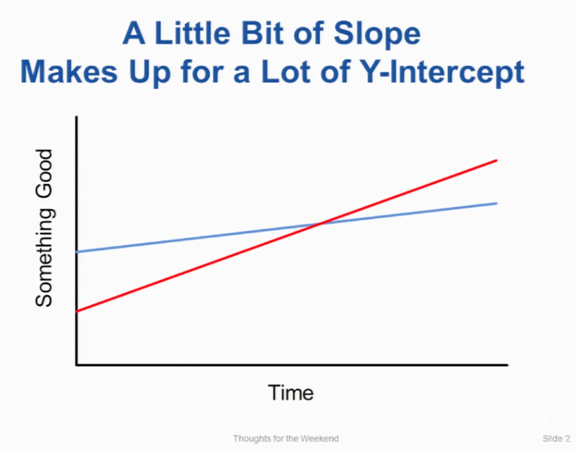

# Algolab 2024

## Table of Contents
1. [Introduction](#introduction)
2. [What is this course about?](#what-is-this-course-about)
3. [How is it erogated?](#how-is-it-erogated)
4. [Outline](#outline)
5. [My Perspective](#my-perspective)
6. [What Will You Find in This Repo?](#what-will-you-find-in-this-repo)
7. [Solutions per Week](#solutions-per-week)
8. [Solutions per Topic](#solutions-per-topic)
9. [General Advices](#general-advices)
10. [My Notes](#my-notes)
11. [How to Compile or Run](#how-to-compile-or-run)
12. [Disclaimer on Problem Statements](#disclaimer-on-problem-statements)
13. [Credits](#credits)
14. [License](#license)

---

## Introduction
This repository contains my personal solutions and explanations for the **Algorithms Lab (Algolab 2024)**. The course is taught in a style similar to the International Olympiad in Informatics (IOI), focusing on solving algorithmic problems from textual and story-like descriptions. 

---

## What is this course about?
The main objective of the course is to learn how to solve algorithmic problems that require:
- **Dynamic Programming (DP)**
- **Greedy Algorithms**
- **Basic Graph Algorithms** (MST, Shortest Path, Matching, etc.)
- **Flow Graph Algorithms** (MaxFlow, MinCut, MinCostMaxFlow, etc.)
- **Geometry** (Delaunay triangulations, advanced computational geometry)
- **Linear Programming (LP)**
- and more!

Over time, the level of difficulty ramps up—toward the end, you must determine which strategy (Greedy, DP, LP, MaxFlow, etc.) is most efficient.

---

## How is it erogated?
- **Weekly Format**:  
  Each week, there are 4 problems closely related to the topic introduced that week. Additionally, there is a **Problem of the Week (POW)** that simulates exam conditions (limited time, hidden tests, etc.).
  
- **From Week 10**:  
  The final four weeks present more challenging problems where it’s not just about coding a known algorithm but also **figuring out** which approach is correct.

---

## Outline


---

## My Perspective
> This course was very fun and interesting, and it boosted my problem-solving skills significantly. It also helped me improve coding-interview skills.  
> However, if you do not have a competitive programming background (as in my case), be prepared to work very hard. I personally put in about three times the usual effort for an 8-ECTS course.  
> Of course, this can vary from person to person, but I believe doing all the exercises and understanding deeply the solutions should be enough for passing the exam, regardless of the background you come from.

---

## What Will You Find in This Repo?
1. **Solutions per Week**: Organized by weekly assignments, including the POW.  
2. **Solutions per Topic**: Organized by theme (DP, MST, Flow, etc.).  
3. **General Advices**: Tips for tackling problems and structuring your code.  
4. **My Notes**: Personal takes on topics like DP, geometry, network flow, etc.  

For each solution, there is:
- **`solution.cpp`**: The fully working code always scoring 100/100 points.  
- **`explanation.md`**: A verbose explanation of my reasoning and approach.

---

## Solutions per Week

| Week   | POW                                                          | Problem 1                                                        | Problem 2                                                         | Problem 3                                                      | Problem 4                                                          |
|--------|--------------------------------------------------------------|------------------------------------------------------------------|-------------------------------------------------------------------|----------------------------------------------------------------|---------------------------------------------------------------------|
| Week 1 | None                                                         | [Dominoes](/src/week01/dominoes)                                 | [Even pairs](/src/week01/even_pairs)                              | [Even matrices](/src/week01/even_matrices)                    | [Build the Sum](/src/week01/build_the_sum)                          |
| Week 2 | [POW 2: Deck of cards](/src/week02/deck_of_cards)            | [Beach bars](/src/week02/beach_bars)                             | [Burning coins](/src/week02/burning_coins)                       | [Defensive line](/src/week02/defensive_line)                  | [The great game](/src/week02/the_great_game)                        |
| Week 3 | [POW 3: James Bond’s sovereign](/src/week03/james_bonds_sovereign) | [First steps with BGL](/src/week03/first_steps_with_bgl)         | [Buddy Selection](/src/week03/buddy_selection)                   | [Ant Challenge](/src/week03/ant_challenge)                    | [Important Bridges](/src/week03/important_bridges)                  |
| Week 4 | [POW 4: The Iron Islands](/src/week04/iron_islands)          | [Hit](/src/week04/hit)                                           | [First Hit](/src/week04/first_hit)                               | [Antenna](/src/week04/antenna)                                 | [Hiking Maps](/src/week04/hiking_maps)                              |
| Week 5 | [POW 5: Tracking](/src/week05/tracking)                      | [Moving Books](/src/week05/moving_books)                         | [Asterix the Gaul](/src/week05/asterix_the_gaul)                 | [Severus Snape](/src/week05/severus_snape)                    | [Boats](/src/week05/boats)                                          |
| Week 6 | [POW 6: Motorcycles](/src/week06/motorcycles)                | [Tiles](/src/week06/tiles)                                       | [Coin Tossing Tournament](/src/week06/coin_tossing)              | [Knights](/src/week06/knights)                                 | [Kingdom Defense](/src/week06/kingdom_defense)                      |
| Week 7 | [POW 7: Octopussy](/src/week07/octopussy)                    | [Bistro](/src/week07/bistro)                                     | [H1N1](/src/week07/H1N1)                                         | [Germs](/src/week07/germs)                                    | [Clues](/src/week07/clues)                                          |
| Week 8 | [POW 8: Attack on King's Landing](/src/week08/attack_on_kings_landing) | [Maximize it!](/src/week08/maximize_it)                          | [Diet](/src/week08/diet)                                         | [Inball](/src/week08/inball)                                  | [Casterly Rock](/src/week08/casterly_rock)                          |
| Week 9 | [POW 9: Idefix](/src/week09/idefix)                          | [Placing Knights](/src/week09/placing_knights)                   | [Real Estate Market](/src/week09/real_estate_market)             | [Canteen](/src/week09/canteen)                                | [Algocoon](/src/week09/algocoon)                                    |
| Week 10| [POW 10: Hermione Granger](/src/week10/hermione_granger)     | [Asterix and the Tour of Gaul](/src/week10/asterix_and_the_tour_of_gaul) | [Rubeus Hagrid](/src/week10/rubeus_hagrid)                    | [San Francisco](/src/week10/san_francisco)                    | [The Hand’s Tourney](/src/week10/the_hands_tourney)                 |
| Week 11| [POW 11: Ceryneian Hind](/src/week11/ceryneian_hind)         | [Asterix in Switzerland](/src/week11/asterix_in_switzerland)     | [Lernaean Hydra](/src/week11/lernaean_hydra)                     | [Sith](/src/week11/sith)                                     | [Wordcup](/src/week11/wordcup)                                      |
| Week 12| [POW 12: Pied Piper](/src/week12/pied_piper)                 | [Alastor Moody](/src/week12/alastor_moody)                       | [Nemean Lion](/src/week12/nemean_lion)                           | [Rapunzel](/src/week12/rapunzel)                             | [Return of the Jedi](/src/week12/return_of_the_jedi)                |
| Week 13| [POW 13: Schneewittchen](/src/week13/schneewittchen)         | [Asterix and the Chariot Race](/src/week13/asterix_and_the_chariot_race) | [Car Sharing](/src/week13/car_sharing)                | [Fighting Pits of Meereen](/src/week13/fighting_pits_of_meereen) | [Suez](/src/week13/suez)                                            |
| Week 14| [POW 14: Ludo Bagman](/src/week14/ludo_bagman)               | -                                                                | -                                                                 | -                                                              | -                                                                   |

---

## Solutions per Topic

| Topic | Problems                                                                                                                                                                                                                     |
|-------|------------------------------------------------------------------------------------------------------------------------------------------------------------------------------------------------------------------------------|
| INTRO | [Build the Sum](/src/week01/build_the_sum)                                                                                                                                                                                 |
| PREFIX | [Even pairs](/src/week01/even_pairs), [Even matrices](/src/week01/even_matrices)                                                                                                                                           |
| DP | [Burning coins](/src/week02/burning_coins), [Defensive line](/src/week02/defensive_line), [The great game](/src/week02/the_great_game), [San Francisco](/src/week10/san_francisco), [Lernaean Hydra](/src/week11/lernaean_hydra), [POW 12: Pied Piper](/src/week12/pied_piper), [Asterix and the Chariot Race](/src/week13/asterix_and_the_chariot_race), [Fighting Pits of Meereen](/src/week13/fighting_pits_of_meereen) |
| SW | [POW 2: Deck of cards](/src/week02/deck_of_cards), [Beach bars](/src/week02/beach_bars)                                                                                                                                       |
| SP | [First steps with BGL](/src/week03/first_steps_with_bgl), [Ant Challenge](/src/week03/ant_challenge), [POW 5: Tracking](/src/week05/tracking), [POW 8: Attack on King's Landing](/src/week08/attack_on_kings_landing), [Alastor Moody](/src/week12/alastor_moody), [Return of the Jedi](/src/week12/return_of_the_jedi)                                                                                                            |
| MST | [First steps with BGL](/src/week03/first_steps_with_bgl), [Ant Challenge](/src/week03/ant_challenge), [Return of the Jedi](/src/week12/return_of_the_jedi)                                                                                                           |
| MM | [Buddy Selection](/src/week03/buddy_selection), [Tiles](/src/week06/tiles), [POW 8: Attack on King's Landing](/src/week08/attack_on_kings_landing)                                                                                                                   |
| SCC | [Important Bridges](/src/week03/important_bridges)                                                                                                                                                                                                                  |
| GC | [Hit](/src/week04/hit), [First Hit](/src/week04/first_hit), [Antenna](/src/week04/antenna), [Hiking Maps](/src/week04/hiking_maps), [POW 6: Motorcycles](/src/week06/motorcycles)                                                                                     |
| GREEDY | [Moving Books](/src/week05/moving_books), [Boats](/src/week05/boats), [POW 7: Octopussy](/src/week07/octopussy), [Rubeus Hagrid](/src/week10/rubeus_hagrid)                                                                                                      |
| S. & L. | [Asterix the Gaul](/src/week05/asterix_the_gaul)                                                                                                                                                                                                                 |
| GREEDP | [Severus Snape](/src/week05/severus_snape)                                                                                                                                                                                                                       |
| MF | [Coin Tossing Tournament](/src/week06/coin_tossing), [Knights](/src/week06/knights), [Kingdom Defense](/src/week06/kingdom_defense), [Placing Knights](/src/week09/placing_knights), [Algocoon](/src/week09/algocoon), [POW 11: Ceryneian Hind](/src/week11/ceryneian_hind), [Asterix in Switzerland](/src/week11/asterix_in_switzerland), [Alastor Moody](/src/week12/alastor_moody) |
| MCMF | [Real Estate Market](/src/week09/real_estate_market), [Canteen](/src/week09/canteen), [Asterix and the Tour of Gaul](/src/week10/asterix_and_the_tour_of_gaul), [Car Sharing](/src/week13/car_sharing), [POW 14: Ludo Bagman](/src/week14/ludo_bagman)                                                      |
| LP | [Maximize it!](/src/week08/maximize_it), [Diet](/src/week08/diet), [Inball](/src/week08/inball), [Casterly Rock](/src/week08/casterly_rock), [POW 10: Hermione Granger](/src/week10/hermione_granger), [Wordcup](/src/week11/wordcup), [POW 13: Schneewittchen](/src/week13/schneewittchen), [Suez](/src/week13/suez) |
| UF | [POW 9: Idefix](/src/week09/idefix), [The Hand’s Tourney](/src/week10/the_hands_tourney), [Sith](/src/week11/sith)                                                                                                                                                    |
| TRI | [Bistro](/src/week07/bistro), [H1N1](/src/week07/H1N1), [Germs](/src/week07/germs), [Clues](/src/week07/clues), [POW 10: Hermione Granger](/src/week10/hermione_granger), [Nemean Lion](/src/week12/nemean_lion)                                                        |
| SW+ | [POW 4: The Iron Islands](/src/week04/iron_islands), [Rapunzel](/src/week12/rapunzel)                                                                                                                                                                               |
| MC | [Algocoon](/src/week09/algocoon), [POW 11: Ceryneian Hind](/src/week11/ceryneian_hind)                                                                                                                                                                               |

> **Legend**:  
> **DP** = Dynamic Programming | **SW** = Sliding Window | **SP** = Shortest Paths | **MST** = Minimum Spanning Tree | **MM** = Maximum Matching | **SCC** = Strongly Connected Components | **GC** = Computational Geometry |  
> **GREEDY** = Greedy Algorithms | **S. & L.** = Split and List | **GREEDP** = Greedy + DP | **MF** = Maximum Flow | **MCMF** = Min Cost Max Flow | **LP** = Linear Programming | **UF** = Union-Find | **TRI** = Triangulation | **SW+** = Sliding Window + More | **MC** = Min-Cut

---

## General Advices
1. **Keep a Standard Template**  
   ```cpp
   #include <bits/stdc++.h>
   using namespace std;
   // Additional typedefs, CGAL/BGL libraries, etc.

   void solve() {
       // The function containing the main logic of your solution
   }

   int main() {
       ios_base::sync_with_stdio(false);
       cin.tie(nullptr);
       int t; cin >> t;
       while(t--) solve();
       return 0;
   }
   ```
   This lets you minimize repetitive code.

2. **Practice with POWs**  
   Each weekly POW is a great way to simulate the exam. Work on your time management and get comfortable with partial points.

3. **Get Familiar with BGL and CGAL**  
   They may look intimidating initially, but you have code snippets and the full documentation available at the exam. Make sure you know how to read official docs for extra features not covered in the snippets.

4. **Partial Points**  
   Don’t be afraid to go for partial solutions. Some test sets are easier and can give you a good chunk of points even if you don’t have the complete solution.

5. **Explore Additional Repositories**  
   If you finish early, there are many repos of previous years containing extra practice problems (however due to the high volume of the exercises it's likely you will not have the time to do them).

---

## My Notes

- [Introduction](/nts/intro.md)
- [Dynamic Programming](/nts/dp.md)
- [Greedy Algorithms](/nts/greedy.md)
- [Split and List](/nts/s_and_l.md)
- [Computational Geometry](/nts/cg.md)
- [Proximity Structures](/nts/prox.md)
- [Linear Programming](/nts/lp.md)
- [Graph Theory](/nts/graphs.md)
- [Network Flow](/nts/flow.md)
- [Advanced Flow](/nts/adv_flow.md)

---

## How to Compile or Run

All solutions in this repository use **C++** (usually C++17 or above). You can compile with any modern C++ compiler:

```bash
# Example: compile and run Dominoes problem from Week 1
cd src/week01/dominoes
g++ -std=c++17 solution.cpp -o dominoes
./dominoes < input.txt
```

Make sure you have installed **BGL** and **CGAL** correctly installed on your system.

---

## Disclaimer on Problem Statements
We are **not** allowed to share the official problem statements for each exercise. Therefore, the texts are not included in this repository. The solutions here refer to those statements, but I often included a quick summary or personal interpretation. If you want to solve these problems independently, please see the official course materials or other official references.

---

## Credits
**Algolab** is a challenging course without always providing official solutions. The following repositories (and their authors) helped me a lot to come up with these solutions:

- [Algolab 2023](https://github.com/lorenzo-asquini/Algolab-2023)  
- [Algolab 2022](https://github.com/jlscheerer/AlgoLab2022/tree/main)  
- [Algolab 2021](https://github.com/haeggee/algolab/tree/main)  
- [Algolab 2020](https://github.com/simon-hrabec/Algolab-2020)

A huge thanks to them for sharing their work!

---

## License
This project is licensed under the **MIT License** — see the [LICENSE](LICENSE) file for details.

---  
   
**Enjoy this fun course and Good Luck!**    
Whatever your starting point, you can do it. 
      
-- Prof. John Ousterhout, Stanford University